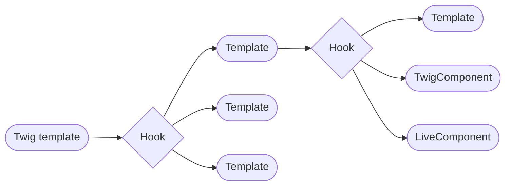
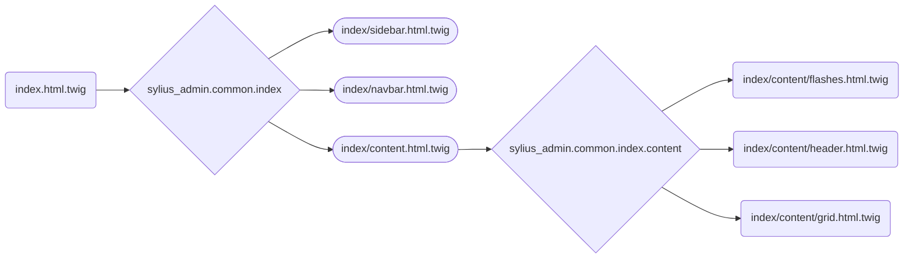

<div align="center">

# Sylius  {Stack} - Nowadays

To The Rescue


</div>

---

## Admin UI


---

Searching menu items in sidebar


---

Filtering grid data


---

Deleting grid item


---

Deleting multiple grid items


---

Sorting grid data


---

Paginating grid data


---

Creating new item


---

Editing existing item


---
layout: center
class: text-center
---


Twig Hooks

---

Twig hooks overview



---

Twig hooks overview for index pages



---

Generic index template

```twig {all|1|4-7|9-10|12-14|16}



{% set prefixes = [
    'sylius_admin.%resource_name%'|[...]),
    'sylius_admin.common'
] %}

<!-- Creating the header (eg: app.ui.books) -->


<!-- Browser page title (eg: Books | Sylius) -->
{{ header|trans }} {{ parent() }}


    

<!-- ... -->
```
 
---

Debugging with profiler


---

Hooking the header


```yaml {all|3-4|5-6|8-10}
## Hook 'header'
'sylius_admin.common.index.content.header':  
    breadcrumbs:
        template: '[...]/header/breadcrumbs.html.twig'
    title_block:
        template: '[...]/header/title_block.html.twig'

'sylius_admin.book.index.content.header':
    description:
        template: 'book/index/content/header/description.html.twig'
```    

---

Hooking templates to add data to the book index template

__Hook__

```yaml {6}
## config/packages/twig_hooks.yaml
sylius_twig_hooks:
    hooks:
        'sylius_admin.book.index.content.header':
            description:
                template: 'book/index/content/header/description.html.twig'

```

__Template__
```html
<!-- templates/book/index/content/header/description.html.twig -->
<p class="mt-3">
    Aliquam arcu ligula, aliquet vitae malesuada quis, accumsan nec metus. Proin lacinia dolor eu convallis mollis. Phasellus quis laoreet ex. Class aptent taciti sociosqu ad litora torquent per conubia nostra, per inceptos himenaeos. Praesent vestibulum dolor est, vel tristique sapien sodales eget. In hac habitasse platea dictumst. Vestibulum ante ipsum primis in faucibus orci luctus et ultrices posuere cubilia curae; Duis vitae viverra leo, vel consectetur tellus. Sed ipsum risus, pharetra id tincidunt et, ultricies at nisl. Morbi nec ultrices elit, vitae vehicula lectus. Nullam venenatis condimentum dui ut vehicula. Vivamus sit amet pharetra justo. Sed sit amet quam nisi.
</p>
<p>
    Etiam ac justo euismod, luctus urna sit amet, pellentesque risus. Vestibulum mi mi, ultrices quis arcu sed, suscipit efficitur metus. Quisque vitae ipsum arcu. Etiam sagittis mollis lacus eu posuere. Nam ac leo ex. Nam vitae dapibus nisl. Pellentesque habitant morbi tristique senectus et netus et malesuada fames ac turpis egestas. Donec ultrices, est at condimentum euismod, ligula tellus hendrerit ex, vel dictum orci augue at magna.
</p>

```

---


---


---

Hooking templates to change logo on the layout

__Hook__

```yaml {all|4|5|6-7}
## config/packages/twig_hooks.yaml
sylius_twig_hooks:
    hooks:
        'sylius_admin.common.component.sidebar':
            logo:
                #template: '@SyliusBootstrapAdminUi/security/common/logo.html.twig'
                template: 'shared/crud/common/sidebar/logo.html.twig'

```

__Template__

```html {all|2|5|6|7}
<!-- templates/shared/crud/common/sidebar/logo.html.twig -->


<h1 class="navbar-brand">
    <a href="{{ dashboard_path }}" style="text-decoration: none">
        
        AFUP
    </a>
</h1>

```

---


